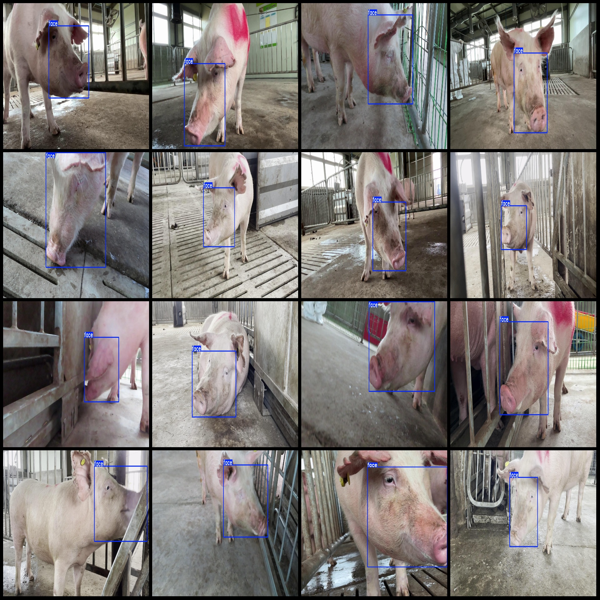
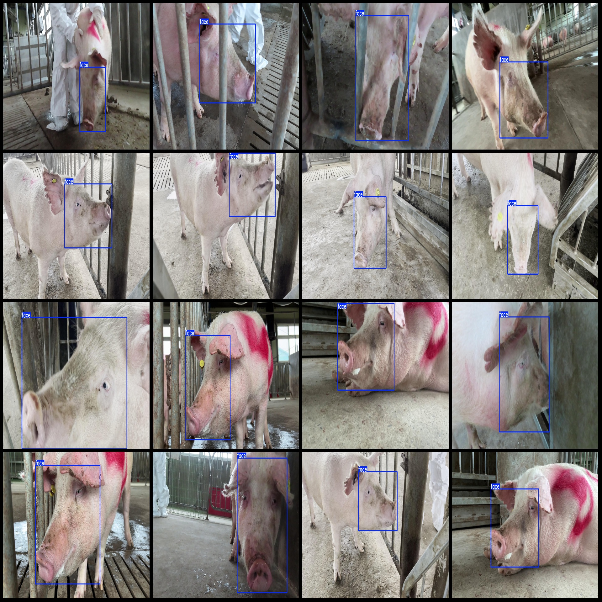

# Intelligent Pig Face Detection Dataset VOC+YOLO Format with 6468 Images in 1 Classification

This dataset is in Pascal VOC format with YOLO format (without split path in the txt file, only including jpg images and corresponding VOC format xml files and YOLO format txt files).

Number of images (jpg file count): 6468
Number of labels (xml file count): 6468
Number of labels (txt file count): 6468
Number of label categories: 1
Label category names: ["face"]
Each category number of boxes:
Face box numbers = 6473
Total box numbers: 6473
Image resolution: 1920x1080
Using labeling tool: labelImg
Labeling rules: draw rectangle boxes for each category
Important note: No special statement.
Special declaration: This dataset does not guarantee the accuracy of the trained model or weight files.
Preview of images:

Here is a pay link on Stripe ( https://buy.stripe.com/3cs8yP7sY87d0vu9AB ). Please contact me lonlonago@foxmail.com after funding $89, and I will send you a complete data files , thank you!

